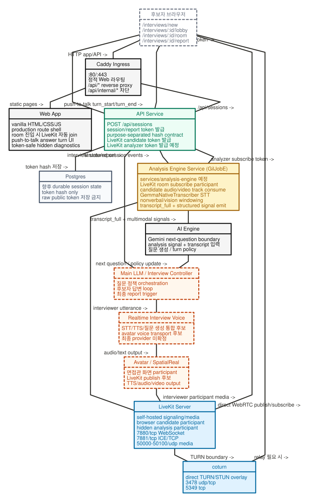

# GilJob v2

GilJob v2는 **한 대의 서버에서 Docker Compose로 실행하는 self-hosted AI 면접 시스템 scaffold**입니다. 목표는 기존 `/home/hoddukzoa/GilJob`를 건드리지 않고, 별도 `GilJob_v2` 작업 공간에서 OpenAI Realtime-only voice, GilJobE 기반 MMM/RNAS 분석, 그리고 선택적 SpatialReal avatar spike를 단계적으로 붙이는 것입니다. LiveKit은 기본 Realtime/MMM 경로가 아니라 legacy/media-overlay 및 AvatarKit RTC 실험 경로입니다. LiveKit is not required for the main Realtime/MMM path; OpenAI Realtime owns STT/VAD/interviewer audio; Avatar disabled/deferred is the default avatar state.



> 중요: 이 repository/worktree는 기존 `/home/hoddukzoa/GilJob`와 분리된 v2 작업 공간입니다. 기존 GilJob 폴더를 복사·삭제·수정하지 않습니다.

## 현재 구현 상태

구현됨:

- 단일 서버 Docker Compose 기반 scaffold
- Caddy ingress (`/api/*` broker, direct `/ai/*`, `/tts/*`, `/avatar/*` 차단)
- Python 기반 `api`, `web`, `analysis-engine`, `agent1` scaffold
- `services/analysis-engine` GilJobE dependency/health/subscriber boundary plus `/realtime/turn-events` MMM sideband ingress
- Postgres service 및 token hash 저장 계약
- OpenAI Realtime + MMM 기본 경로에서는 필요 없는 optional self-hosted LiveKit/coturn media overlay
- `POST /api/sessions` 후보자 session 생성
- optional/legacy media overlay 사용 시에만 LiveKit browser media token metadata 발급
- SpatialReal AvatarKit RTC용 별도 subscribe-only avatar viewer token 발급은 legacy/deferred avatar path
- production 형태의 interview routes
  - `/interviews/new`
  - `/interviews/:id/lobby`
  - `/interviews/:id/room`
  - `/interviews/:id/report`
- 실제 room route는 OpenAI Realtime/MMM을 우선하며 LiveKit join은 optional/legacy media overlay 조건에서만 사용
- room 내부 prejoin/setup UI 제거
- Zoom/Google Meet형 light interview room shell
- push-to-talk 답변 흐름
  - 면접관 질문/TTS 종료 후 `답변 시작` 활성화
  - 후보자가 버튼을 눌러 답변 시작
  - 다시 버튼을 눌러 답변 종료 및 다음 질문 요청
- OpenAI Realtime WebRTC broker route for live interviewer audio
  - `OPENAI_REALTIME_PRIMARY=true` is the realtime branch default; missing credentials fail closed rather than falling back to another voice provider
  - browser obtains only Realtime session metadata through `/api/interviews/:id/realtime/session`
  - browser attaches SDP through GilJob API `/api/interviews/:id/realtime/call`; the standard OpenAI key and provider route stay server-side
  - `OPENAI_API_KEY` stays server-side; do not introduce a browser-visible OpenAI key
- API-mediated Realtime turn/vision/MMM readiness routes
  - `/api/interviews/:id/turns/:turnIndex/events`
  - `/api/interviews/:id/turns/:turnIndex/vision-events`
  - `/api/interviews/:id/turns/:turnIndex/mmm-ready`
- first Realtime interviewer question is bootstrap-only and does not require MMM; follow-up Realtime response creation is gated on the prior answer's `full_mmm_ready`
- SpatialReal session-token broker
- SpatialReal RTC/LiveKit client renderer shell은 deprecated/deferred avatar path
- SpatialReal Python SDK LiveKit egress 시도 경로는 optional post-TTS compatibility path
  - current egress sends server-generated TTS WAV payloads, not OpenAI Realtime remote audio; avatar lip-sync to Realtime audio is a known limitation
- 로컬 Whisper/STT service 제거 완료; STT는 `GilJobE` 기반 `services/analysis-engine` 경계
- token redaction 및 raw token 비노출 contract test

아직 범위 밖 또는 제한적:

- CV/job parsing
- production-grade Main LLM orchestration/state machine
- final report generator
- production domain/TLS/hardening
- Redis/event bus 전환
- SpatialReal avatar/lip-sync production claim. Current outcome is `sdk_mode_deferred`; the next non-LiveKit proof should evaluate SpatialReal SDK Mode Web first, with Host Mode as fallback. Legacy AvatarKit RTC still needs public LiveKit reachability and remains outside the default success claim.

## Production UX 기준

라우트 책임은 아래처럼 나눕니다.

| Route | 책임 | 현재 상태 |
|---|---|---|
| `/interviews/new` | CV, 직무 링크, persona 선택 진입점 | placeholder |
| `/interviews/:id/lobby` | device readiness, 입장 전 확인 | placeholder |
| `/interviews/:id/room` | 실제 면접룸 | OpenAI Realtime/MMM 우선 + push-to-talk room shell; LiveKit join은 optional/legacy overlay |
| `/interviews/:id/report` | 면접 종료 후 report | placeholder |

`room`은 Zoom/Google Meet처럼 “이미 방에 들어온 화면”이어야 합니다. 따라서 room 내부에는 prejoin form, endpoint 입력, “Join room” 버튼, 개발용 긴 설명문을 두지 않습니다. 입장 준비는 lobby가 담당하고, room은 mic/camera/leave/report control과 숨김 drawer형 면접 상태 패널만 보여줍니다.

## 아키텍처 요약

핵심 경계:

1. 브라우저는 GilJob Web/API HTTP 요청을 Caddy로 보냅니다.
2. API는 session/report token을 발급하되, 서버 쪽에는 purpose-separated hash만 저장합니다.
3. API는 default Realtime/MMM 경로에서 LiveKit token을 요구하지 않습니다. Optional/legacy media overlay를 켠 경우에만 LiveKit candidate token과 SpatialReal AvatarKit RTC viewer token을 분리해 발급합니다.
4. LiveKit을 사용하는 legacy/media overlay에서만 브라우저는 Caddy를 통해 media를 프록시하지 않고, API가 반환한 `LIVEKIT_PUBLIC_URL`로 LiveKit에 직접 연결합니다. 기본 Realtime/MMM 경로는 LiveKit 없이 동작해야 합니다.
5. 후보자 답변 분석의 priority-1 Realtime 경로는 **answer → analysis-engine MMM/RNAS → API `response.create` → OpenAI Realtime output**입니다. 브라우저는 Realtime STT transcript/prosody와 low-resolution internal vision sideband를 API로 보내고, analysis-engine이 exact `(interviewId, turnIndex)` RNAS result/readiness의 단일 owner입니다. Durable/public records expose only structured signals and candidate-safe prompt fragments, never raw transcript/media/provider secrets.
6. OpenAI Realtime primary mode에서는 API가 `/api/interviews/:id/realtime/session`에서 Realtime session metadata를 중개하고, 브라우저의 WebRTC SDP attach도 `/api/interviews/:id/realtime/call`을 통해 서버가 수행합니다. 표준 OpenAI API key와 provider route는 브라우저에 노출하지 않습니다.
7. Realtime turn loop는 `turn 1 bootstrap`만 MMM 없이 시작하고, `turn N>=2`는 직전 답변의 exact-turn RNAS result가 `ready`일 때만 API-authored `response.create`를 허용합니다. 즉 ordinary follow-up은 `exact prior-turn full MMM readiness`가 필요합니다. 브라우저는 API-approved command를 data channel로 relay할 뿐 prompt나 `response.create`를 직접 작성하지 않습니다.
8. Legacy question/TTS routes are removed from the default path: API returns `deprecated_ai_engine_removed` with `reason=realtime_only`, and OpenAI Realtime-only owns live interviewer voice. Gemini fallback is not supported.
9. SpatialReal/AvatarKit은 Realtime/MMM 성공 조건과 분리된 opt-in avatar path입니다. 기본값은 `sdk_mode_deferred`지만, `SPATIALREAL_SDK_MODE_WEB_ENABLED=true`와 서버측 `SPATIALREAL_API_KEY`가 있으면 API가 short-lived SpatialReal session token을 발급해 `/api/interviews/:id/avatar/session`에서 browser-approved SDK metadata만 반환합니다.
10. SpatialReal SDK Mode Web은 LiveKit 없이 브라우저에서 `@spatialwalk/avatarkit`을 초기화하고, OpenAI Realtime output audio의 muted PCM16 copy를 avatar controller에 feed하는 구조입니다. 이 token broker는 provider key를 브라우저에 노출하지 않으며, production lip-sync claim은 kiostation browser proof가 있어야만 가능합니다.
11. `SPATIALREAL_RTC_LIVEKIT_URL`은 legacy RTC egress를 켤 때만 필요하며 SpatialReal cloud에서 접근 가능한 public URL이어야 합니다. OpenAI Realtime remote audio를 SpatialReal에 주입하는 production bridge가 아니므로 Realtime avatar lip-sync claim에 쓰지 않습니다.
12. Legacy AvatarKit RTC/LiveKit bridge flags are not part of the default Realtime/MMM/SDK path. Do not reintroduce `SPATIALREAL_BROWSER_AUDIO_BRIDGE_ENABLED` or browser-direct provider routes for this path.

위 다이어그램의 NOML 원본 파일: [`docs/architecture.noml`](docs/architecture.noml)

```noml
#.service: fill=#f5f5f5 stroke=#111111
#.external: fill=#ffffff stroke=#6b7280 dashed
#.media: fill=#e0f2fe stroke=#0369a1
#.secure: fill=#ecfdf5 stroke=#047857
#.future: fill=#fff7ed stroke=#c2410c dashed
#.store: fill=#f8fafc stroke=#475569
#.analysis: fill=#fef3c7 stroke=#a16207

[<external> 후보자 브라우저|
  /interviews/:id/room
  OpenAI Realtime WebRTC participant
  MMM sideband sender
  avatar disabled/deferred by default
]

[<service> Caddy Ingress|
  :80/:443
  정적 Web 라우팅
  /api/* reverse proxy
  direct /ai,/tts,/avatar 차단
]

[<service> Web App|
  vanilla HTML/CSS/JS
  production room shell
  OpenAI Realtime/MMM primary UI
  optional legacy LiveKit join
  push-to-talk answer turn UI
  token-safe hidden diagnostics
]

[<secure> API Service|
  POST /api/sessions
  session/report token 발급
  purpose-separated hash contract
  Realtime session/call broker
  optional LiveKit token only for media overlay
  AvatarKit RTC viewer token is legacy/deferred
  /api/interviews/:id/* broker
  Realtime MMM sideband forward
]

[<store> Postgres|
  durable session state 예정
  token hash only
  raw public token 저장 금지
]

[<media> LiveKit Server|
  self-hosted signaling/media
  browser candidate participant
  analysis subscriber participant
  avatar publisher/viewer participants
  7880/tcp WebSocket
  7881/tcp ICE/TCP
  50000-50100/udp media
]

[<media> coturn|
  TURN/STUN relay 후보
  direct media 실패 시 relay
]

[<analysis> Analysis Engine Service\n(GilJobE)|
  Realtime sideband MMM/RNAS owner
  exact-turn result readiness
  legacy LiveKit subscriber only for compatibility
  transcript_full + structured signal emit
]

[<service> OpenAI Realtime API|
  /v1/realtime/client_secrets
  /v1/realtime/calls server-side SDP attach
  browser-facing API call broker only
  interviewer audio + transcript events
]


[<media> SpatialReal Cloud|
  SDK Mode / Host Mode candidate
  RTC Mode deprecated/deferred
  no production lip-sync claim
]

[<future> Main LLM / Interview Controller|
  질문 정책 orchestration 강화 예정
  후보자 답변 loop
  최종 report trigger
]

[후보자 브라우저] - HTTP app/API -> [Caddy Ingress]
[Caddy Ingress] - static pages -> [Web App]
[Caddy Ingress] - /api/* -> [API Service]
[API Service] - token hash 저장 -> [Postgres]
[API Service] - Realtime session/call metadata -> [후보자 브라우저]
[API Service] - optional media/avatar token only when overlay enabled -> [후보자 브라우저]
[후보자 브라우저] - optional legacy WebRTC publish/subscribe -> [LiveKit Server]
[후보자 브라우저] - deprecated AvatarKit RTC subscribe -> [LiveKit Server]
[후보자 브라우저] - push-to-talk turn_start/turn_end -> [API Service]
[API Service] - server key -> ephemeral Realtime secret -> [OpenAI Realtime API]
[후보자 브라우저] - ephemeral SDP attach only -> [OpenAI Realtime API]
[OpenAI Realtime API] - interviewer audio/transcript events -> [후보자 브라우저]
[후보자 브라우저] - STT transcript/prosody/low-res vision sideband -> [API Service]
[API Service] - full_mmm_ready gate -> [후보자 브라우저]
[API Service] - internal MMM events /realtime/turn-events -> [Analysis Engine Service\n(GilJobE)]
[LiveKit Server] - legacy media tracks -> [Analysis Engine Service\n(GilJobE)]
[Analysis Engine Service\n(GilJobE)] - exact-turn candidate-safe structured result -> [API Service]
[SpatialReal Cloud] - legacy RTC avatar stream if enabled -> [LiveKit Server]
[API Service] - response policy context -> [Main LLM / Interview Controller]
[Main LLM / Interview Controller] - interview state/report -> [API Service]
[후보자 브라우저] - relay 필요 시 -> [coturn]
[LiveKit Server] - TURN boundary -> [coturn]
```

렌더링 예시:

```bash
npx --yes nomnoml docs/architecture.noml docs/assets/architecture.svg
```

## Repository 구조

```text
apps/web/                       # 정적 web shell + Realtime/MMM room UI; LiveKit join is optional/legacy
services/api/                   # session/token/API broker scaffold
services/analysis-engine/       # GilJobE STT/multimodal analysis boundary; services/analysis-engine/server.py adds MMM ingress
services/agent1/                # legacy/future multimodal placeholder
infra/docker-compose.yml        # base single-server stack
infra/docker-compose.media.yml  # LiveKit/coturn overlay
services/*/requirements.txt     # service별 Python dependency
requirements.txt                # 로컬 개발/검증용 Python dependency 집계 파일
apps/web/package.json           # browser vendor dependency lock
scripts/                        # smoke / browser join scripts
tests/contract/                 # API/Web/static contract tests
```

## 설치 / 실행 방법

### 0. 필요 도구

- Docker + Docker Compose plugin
- Python 3.12+
- Node.js 20+ / npm
- GitHub CLI (`gh`)는 PR 작업 시에만 필요

### 1. repository 준비

```bash
git clone https://github.com/GilJob-E/giljob-docker.git GilJob_v2
cd GilJob_v2
```

### 2. 환경변수 생성

```bash
cp .env.example .env
```

기본 Realtime/MMM 실행에 필요한 최소 값:

```env
POSTGRES_PASSWORD=change-me-before-deploy
SESSION_TOKEN_HASH_SECRET=change-me-session-token-hash-secret
REPORT_TOKEN_HASH_SECRET=change-me-report-token-hash-secret
OPENAI_REALTIME_PRIMARY=true
OPENAI_REALTIME_MODEL=gpt-realtime-2
OPENAI_REALTIME_VOICE=marin
OPENAI_REALTIME_CALL_BROKER_ENABLED=true
OPENAI_API_KEY=replace-me-openai-server-key
REALTIME_MMM_FORWARD_ENABLED=true
MAX_REALTIME_VISION_EVENT_BYTES=65536
MAX_REALTIME_VISION_FRAME_BYTES=49152
```

Optional SpatialReal SDK avatar QA를 켤 때만 추가:

```env
SPATIALREAL_SDK_MODE_WEB_ENABLED=true
SPATIALREAL_API_KEY=replace-me-server-only-spatialreal-key
SPATIALREAL_APP_ID=replace-me-spatialreal-app-id
SPATIALREAL_AVATAR_ID=replace-me-spatialreal-avatar-id
SPATIALREAL_ENVIRONMENT=intl
SPATIALREAL_REGION=ap-northeast
SPATIALREAL_SESSION_TTL_SECONDS=600
```

Optional legacy/media overlay 또는 SpatialReal RTC 실험을 켤 때만 추가:

```env
LIVEKIT_API_KEY=replace-me-local-only
LIVEKIT_API_SECRET=replace-me-local-only-minimum-32-bytes
TURN_REALM=turn.example.com
TURN_STATIC_AUTH_SECRET=replace-me-local-only-minimum-32-bytes
LIVEKIT_INTERNAL_URL=ws://livekit:7880
LIVEKIT_PUBLIC_URL=ws://127.0.0.1:7880
LIVEKIT_NODE_IP=127.0.0.1

# Optional legacy media room only; not a default Realtime/MMM requirement.
# SpatialReal RTC egress is separate from the default SDK Mode Web path.
```

Optional coach feedback LLM을 실제 provider로 켤 때만 추가:

```env
COACH_LLM_PROVIDER=gemini
COACH_GEMINI_API_KEY=replace-me-gemini-key
GEMINI_API_BASE=https://generativelanguage.googleapis.com/v1beta

# 또는 기존 OpenAI server key를 사용:
# COACH_LLM_PROVIDER=openai
# OPENAI_API_KEY=replace-me-openai-server-key
# OPENAI_API_BASE=https://api.openai.com/v1

# 비워두면 provider 기본값(openai: gpt-4.1-mini, gemini: gemini-2.5-flash)을 사용합니다.
COACH_LLM_MODEL=
COACH_LLM_TIMEOUT_SECONDS=15
```

> `.env`는 절대 commit하지 않습니다. README와 test output에도 provider key, JWT, session token을 출력하지 않습니다.

### 3. Python requirements 설치 (로컬 개발/테스트용)

Docker build는 각 service의 `services/*/requirements.txt`를 사용합니다. 로컬에서 import/test를 확인하려면 루트 집계 파일을 사용할 수 있습니다.

```bash
python3 -m venv .venv
. .venv/bin/activate
pip install -r requirements.txt
```

개별 service만 설치할 수도 있습니다.

```bash
pip install -r services/api/requirements.txt
pip install -r services/analysis-engine/requirements.txt
```

### 4. Web dependency lock 확인

```bash
cd apps/web
npm ci --omit=dev --ignore-scripts
npm run check:js
cd ../..
```

Default Realtime/MMM 개발은 SpatialReal/LiveKit package 설치나 `LIVEKIT_PUBLIC_URL`에 의존하지 않습니다. `@spatialwalk/avatarkit-rtc` / `livekit-client` 호환성은 legacy avatar RTC path에서만 lockfile과 contract tests 기준으로 유지합니다. SDK Mode Web spike는 별도 증거가 생기기 전까지 `sdk_mode_deferred`입니다.

### 5. Compose config 확인

```bash
./scripts/smoke.sh config
```

또는 직접:

```bash
docker compose --env-file .env -f infra/docker-compose.yml config >/tmp/giljob-base.yml
docker compose --env-file .env -f infra/docker-compose.yml -f infra/docker-compose.media.yml config >/tmp/giljob-media.yml
```

### 6. Local media stack 실행

```bash
docker compose --env-file .env -f infra/docker-compose.yml -f infra/docker-compose.media.yml up -d --build
```

상태 확인:

```bash
docker compose --env-file .env -f infra/docker-compose.yml -f infra/docker-compose.media.yml ps
```

브라우저 확인:

```text
http://127.0.0.1/interviews/new
http://127.0.0.1/interviews/local-demo/lobby
http://127.0.0.1/interviews/local-demo/room
http://127.0.0.1/interviews/local-demo/report
```

종료:

```bash
docker compose --env-file .env -f infra/docker-compose.yml -f infra/docker-compose.media.yml down
```

### 7. Smoke 실행

```bash
KEEP_STACK=1 ./scripts/smoke.sh media-up
./scripts/smoke.sh browser-join
./scripts/smoke.sh realtime-ready
```

OMX/team verification lanes must run these checks on `hoddukzoa@kiostation` from the leader-approved checkout, not from a local Mac worktree. Use the same command shape through SSH, for example:

```bash
ssh hoddukzoa@kiostation 'cd /home/hoddukzoa/GilJob_v2 && ./scripts/smoke.sh config'
ssh hoddukzoa@kiostation 'cd /home/hoddukzoa/GilJob_v2 && ./scripts/smoke.sh realtime-ready'
```

`KEEP_STACK=1`을 빼면 smoke 종료 후 stack을 내립니다.

Realtime primary/live smoke는 redacted readiness check로 분리해서 실행합니다.

```bash
./scripts/smoke.sh realtime-ready
REQUIRE_REALTIME_LIVE=1 ./scripts/smoke.sh realtime-ready
```

Operator contract:

- OPENAI_API_KEY is the only OpenAI server key; do not add OPENAI_REALTIME_API_KEY.
- OpenAI Realtime is the only live interviewer voice path when `OPENAI_REALTIME_PRIMARY=true`; legacy `/question` and `/tts` routes are keyless/internal smoke or compatibility paths only, not fallback voice paths.
- The browser receives only browser-safe Realtime session metadata from `/api/interviews/:id/realtime/session`; WebRTC SDP attach goes through `/api/interviews/:id/realtime/call`, not a browser-direct provider route or browser-held provider secret.
- Realtime provider requests keep the `{"session": {...}} wrapper`, omit session.metadata, and never return server keys, provider routes, SDP, or client-secret values to logs/UI.
- `full_mmm_ready` and exact-turn analysis result acceptance must pass before API-authored `response.create`; full_mmm_ready must pass before realtime.response.create; latency evidence is redacted spans only.
- `realtime.call` must be API-brokered for live browser WebRTC. A disabled/prepared broker is a runtime blocker for actual Realtime browser QA, even if static session/MMM readiness is healthy.
- `request_failed / Connection refused` against room/app routes is stale-runtime evidence, not a provider-secret or frontend-contract leak by itself.

Kiostation evidence rule:

- Final team/runtime evidence comes from `ssh hoddukzoa@kiostation 'cd /home/hoddukzoa/GilJob_v2 && ...'` after the approved checkout is synced and restarted.
- Store or report only redacted readiness categories and timing spans: `primaryOk`, `liveReady`, `staticReadiness`, `sessionRoutes`, `realtimeSessionBroker`, `realtimeCallBoundary`, `fullMmmGate`, `realtime.first_audio`, broker/SDP/MMM durations.
- Do not paste or persist raw OpenAI client secrets, SDP, JWTs, LiveKit tokens, transcript text, raw media, or provider error bodies.
- A local worker pass proves syntax/contracts only; it is not a substitute for kiostation smoke/latency evidence.

## Optional legacy AvatarKit RTC / public LiveKit 메모

이 섹션은 기본 Realtime/MMM 경로가 아니라 legacy AvatarKit RTC 또는 SpatialReal-to-LiveKit egress를 켤 때만 적용됩니다. SpatialReal avatar egress는 SpatialReal cloud가 LiveKit에 직접 접속해야 합니다. 따라서 `SPATIALREAL_RTC_LIVEKIT_URL`은 `127.0.0.1`이 아니라 외부에서 접근 가능한 `wss://...`여야 합니다. 현재 egress 입력은 별도 검증이 필요한 legacy post-TTS WAV입니다. OpenAI Realtime WebRTC remote audio를 SpatialReal로 주입하는 production bridge는 아직 검증되지 않았으므로, Realtime 음성과 avatar lip-sync가 일치한다고 문서화하거나 demo claim으로 사용하지 않습니다.

### SpatialReal SDK Mode Web spike status

Current default outcome: `sdk_mode_deferred`. When explicitly enabled and configured, the API uses server-side `SPATIALREAL_API_KEY` to mint a short-lived SpatialReal session token and returns `client.spatialrealSdk` from `/api/interviews/{id}/avatar/session`. The browser then initializes `@spatialwalk/avatarkit`, mutes SDK playback, and feeds a PCM16 mono 16 kHz copy of OpenAI Realtime output to the avatar controller. Record `sdk_mode_verified`, `sdk_mode_blocked_provider_token_broker`, `sdk_mode_not_supported_current_version`, `sdk_mode_blocked_by_audio_feed`, or `sdk_mode_deferred` from kiostation browser QA; do not claim production lip-sync until that proof exists.

### SpatialReal SDK Mode / Host Mode fallback status

`SPATIALREAL_SDK_MODE_WEB_ENABLED=false` and `SPATIALREAL_SDK_MODE_OUTCOME=sdk_mode_deferred` keep the stable default unchanged: OpenAI Realtime remains the only audible interviewer voice path, MMM readiness still gates ordinary `response.create`, and avatar rendering is disabled/deferred. The browser may display only safe SDK Mode status metadata; it must not expose provider secrets, raw media, transcripts, or direct provider routes. If SDK Mode Web cannot be verified on kiostation, Host Mode fallback is the next evaluation path.

임시 개발용 quick tunnel 예시:

```bash
docker run -d --name giljob-v2-cloudflared-livekit \
  --restart unless-stopped \
  --network giljob-v2_default \
  cloudflare/cloudflared:latest \
  tunnel --no-autoupdate --url http://livekit:7880

docker logs giljob-v2-cloudflared-livekit
```

출력된 `https://...trycloudflare.com`를 `wss://...`로 바꿔 `.env`에 반영합니다.

```env
LIVEKIT_PUBLIC_URL=wss://...trycloudflare.com
SPATIALREAL_RTC_LIVEKIT_URL=wss://...trycloudflare.com
SPATIALREAL_RTC_EGRESS_ENABLED=true
```

영구 `livekit.giljob.org` route를 만들려면 Cloudflare API token에 최소한 Tunnel write와 DNS record write 권한이 필요합니다.

주의: Cloudflare Tunnel은 LiveKit signaling/WebSocket에는 유용하지만, WebRTC media path는 TURN 또는 public media ports가 추가로 필요할 수 있습니다.

## Port contract

| Port | 용도 |
|---|---|
| `80/tcp`, `443/tcp` | Caddy web/API ingress |
| `7880/tcp` | LiveKit API/WebSocket signaling |
| `7881/tcp` | LiveKit ICE/TCP fallback |
| `50000-50100/udp` | LiveKit WebRTC media range |
| `3478/udp+tcp`, `5349/tcp` | coturn relay |

## 보안 계약

반드시 유지해야 하는 계약:

- `/api/internal/*`는 외부에서 404로 차단합니다.
- direct `/ai/*`, `/tts/*`, `/avatar/*`는 외부에서 차단합니다.
- session/report public token은 create-session response에서만 반환합니다.
- 서버 저장소에는 raw token을 저장하지 않고 hash만 저장합니다.
- session token과 report token은 purpose-separated hash secret을 사용합니다.
- browser visible UI와 event log에는 raw JWT, `access_token`, `join_request`, `gj_session_*`, `gj_report_*`, provider key를 노출하지 않습니다.
- OpenAI Realtime 표준 API key는 server-only입니다. 브라우저는 API broker가 발급한 ephemeral client secret으로만 WebRTC SDP attach를 수행합니다.
- 첫 Realtime 질문은 이전 답변이 없으므로 bootstrap 예외로 처리합니다. 이후 ordinary Realtime next-question audio는 previous answer turn의 exact RNAS result가 analysis-engine에서 `ready`로 accepted 된 뒤에만 API-approved `response.create`를 browser transport로 relay합니다.
- production/shared 환경에서는 `.env.example`의 `change-me`, `replace-me-local-only` 값을 그대로 쓰지 않습니다.

## 검증 명령

```bash
PYTHONDONTWRITEBYTECODE=1 python3 -m py_compile services/api/server.py services/analysis-engine/server.py
python3 -m py_compile \
  services/api/app/livekit_tokens.py \
  apps/web/server.py
node --check apps/web/static/app.js
node --check scripts/browser-join-smoke.mjs
PYTHONDONTWRITEBYTECODE=1 python3 -m unittest discover -s tests/contract -p 'test_*_contract.py' -v
(cd apps/web && npm run check:js)
(cd apps/web && npm audit --omit=dev --audit-level=high)
npx --yes pyright
```

원격 single-server에서 확인할 때는 `/home/hoddukzoa/GilJob_v2` 기준으로 실행합니다. OMX/team lanes에서 실제 runtime 검증 명령은 `ssh hoddukzoa@kiostation`으로만 실행하고 rebuild/restart 범위는 `api web analysis-engine caddy`입니다. 기존 `/home/hoddukzoa/GilJob`는 건드리지 않습니다.

## 관련 문서

- [`DESIGN.md`](DESIGN.md)
- [`docs/architecture.noml`](docs/architecture.noml)
- [`docs/demo-screenshots.md`](docs/demo-screenshots.md)
- [`docs/implementation-plan.md`](docs/implementation-plan.md)
- [`docs/runbooks/local-livekit-media.md`](docs/runbooks/local-livekit-media.md)
- [`docs/runbooks/tts-avatar-contract.md`](docs/runbooks/tts-avatar-contract.md)
- [`docs/runbooks/verification.md`](docs/runbooks/verification.md)
- [`docs/decisions/0001-state-stack.md`](docs/decisions/0001-state-stack.md)
- [`docs/decisions/0002-ingress-stack.md`](docs/decisions/0002-ingress-stack.md)
- [`docs/decisions/0003-realtime-voice-flow.md`](docs/decisions/0003-realtime-voice-flow.md)
- [`docs/decisions/0004-livekit-free-realtime-mmm-spatialreal-sdk.md`](docs/decisions/0004-livekit-free-realtime-mmm-spatialreal-sdk.md)

## 다음 구현 후보

1. SpatialReal SDK Mode Web non-LiveKit spike: verify package/API availability and muted PCM16 mono audio feed
2. API Realtime sideband → analysis-engine MMM forward evidence 강화
3. Legacy SpatialReal RTC egress 실패 원인 세분화 및 provider error telemetry 강화
4. Optional TURN/public media path 구성 검증
5. Main LLM / InterviewController turn orchestration 강화
6. final report placeholder를 실제 report generator로 교체
