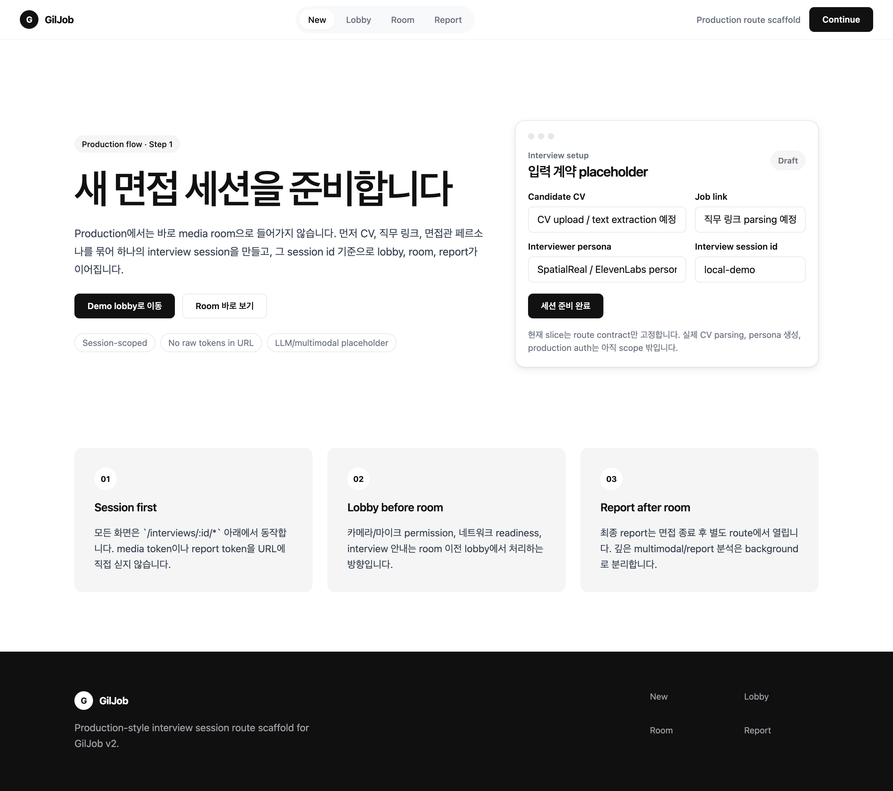
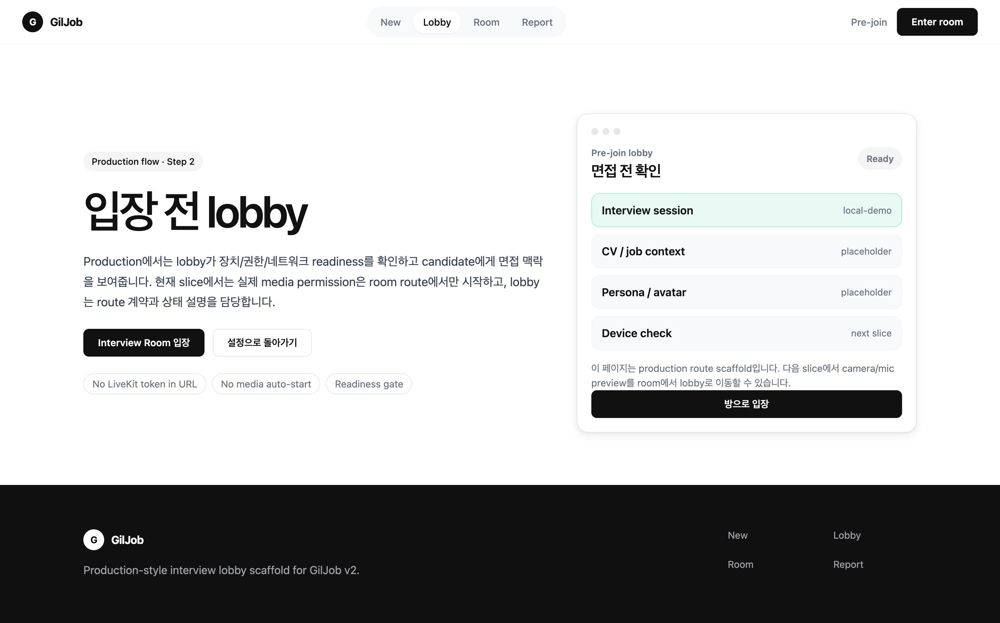
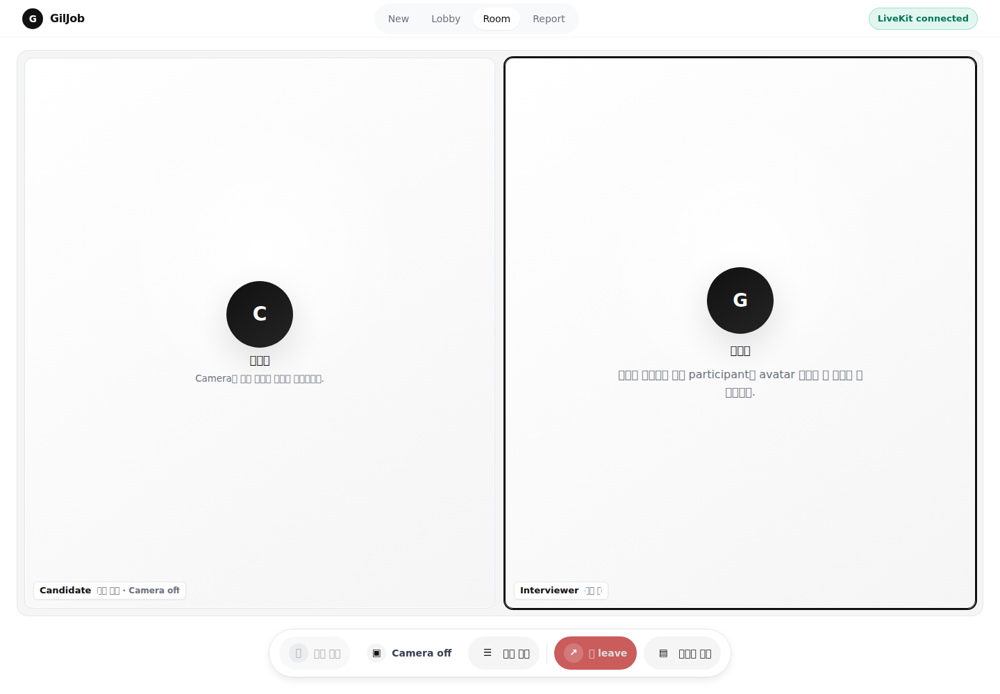
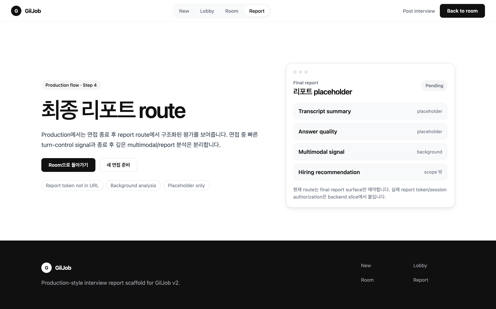

# 데모 스크린샷

이 문서는 GilJob v2의 현재 production route scaffold를 빠르게 리뷰하기 위한 스크린샷 모음입니다. 캡처 대상은 `local-demo` interview id 기준이며, 실제 full product가 아니라 현재 self-hosted LiveKit room slice의 시각적/라우트 계약을 보여줍니다.

## 캡처 환경

- 캡처일: 2026-05-31
- 대상 URL: `http://127.0.0.1:8080`
- 캡처 방식: Chrome DevTools viewport screenshot / route별 full-page review
- Viewport: `1440 x 1000`
- Demo interview id: `local-demo`
- Media 상태: room route에서 LiveKit 자동 join 확인, 답변 대기/camera off 상태

## Route 흐름

| 순서 | Route | 책임 | 스크린샷 |
|---:|---|---|---|
| 1 | `/interviews/new` | CV, 직무 링크, persona 선택을 위한 session setup surface | [`01-new-interview.png`](assets/demo/01-new-interview.png) |
| 2 | `/interviews/local-demo/lobby` | 입장 전 readiness/lobby surface | [`02-lobby.png`](assets/demo/02-lobby.png) |
| 3 | `/interviews/local-demo/room` | 실제 LiveKit 면접룸 surface | [`03-interview-room.png`](assets/demo/03-interview-room.png) |
| 4 | `/interviews/local-demo/report` | 면접 종료 후 report surface placeholder | [`04-report.png`](assets/demo/04-report.png) |

## 1. New interview setup



확인 포인트:

- 면접은 root page에서 바로 media room으로 들어가지 않고 `/interviews/new`에서 시작합니다.
- CV, 직무 링크, persona 입력은 아직 placeholder입니다.
- session id 기준으로 lobby, room, report가 이어지는 production route contract를 보여줍니다.

## 2. Lobby



확인 포인트:

- lobby는 prejoin/readiness를 담당하는 route입니다.
- 현재 slice에서는 실제 device preview를 아직 lobby로 옮기지 않았고, route 책임과 상태 설명만 고정했습니다.
- LiveKit token이나 report token은 URL에 노출하지 않습니다.

## 3. Interview room



확인 포인트:

- room은 실제 면접 surface입니다.
- room 진입 시 LiveKit session이 자동 생성되고 join됩니다.
- room 내부에는 prejoin form, endpoint 입력, `Join room` 버튼, 긴 개발 설명문이 없습니다.
- 기본 meeting view는 light surface에서 스크롤 없이 후보자/면접관 타일과 하단 control dock만 보여줍니다.
- 질문/답변/multimodal state는 기본 숨김 상태의 `면접 패널` Drawer로 분리했습니다.
- visible control은 답변 시작/종료, camera, 면접 패널, leave, report 중심입니다. 단, `답변 시작`은 면접관 질문 종료 이벤트 이후 활성화됩니다.

## 4. Report



확인 포인트:

- report route는 면접 종료 후 final report surface를 예약합니다.
- transcript summary, answer quality, multimodal signal, hiring recommendation은 아직 placeholder입니다.
- 면접관 질문 종료 후 후보자가 버튼으로 답변 시작/종료 turn boundary를 명시하고, 종료 후 깊은 report 분석을 분리하는 UX 방향을 유지합니다.

## 다시 캡처하는 방법

로컬 터널 또는 서버에서 앱이 떠 있는 상태에서 같은 route를 full-page screenshot으로 다시 캡처하면 됩니다.

```text
http://127.0.0.1:8080/interviews/new
http://127.0.0.1:8080/interviews/local-demo/lobby
http://127.0.0.1:8080/interviews/local-demo/room
http://127.0.0.1:8080/interviews/local-demo/report
```

room screenshot을 다시 찍을 때의 acceptance 기준:

- `#status`가 `LiveKit connected`가 될 것
- page scroll이 생기지 않을 것
- `#room-context-drawer`가 기본 hidden일 것
- `#join-form`이 없을 것
- `#join-room`이 없을 것
- `Pre-join checklist`, `Camera preview`, `Self-hosted LiveKit · Interview Room` 같은 prejoin/개발 설명 copy가 보이지 않을 것
